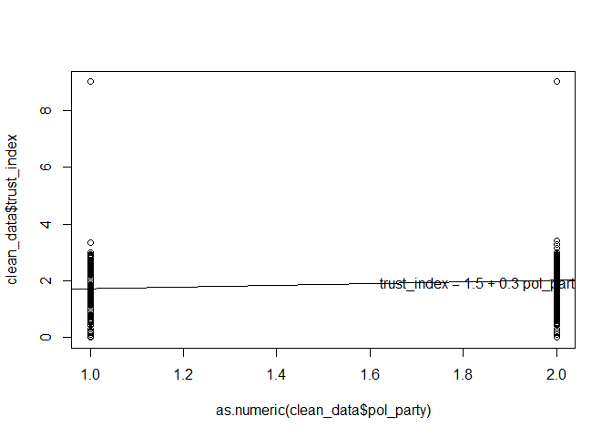

Bivariate Linear Regression
================

``` r
# Loading the data
library(haven)
```

    ## Warning: package 'haven' was built under R version 4.3.3

``` r
clean_data <- read_dta("~/GitHub/ppol1802/clean_data.dta")

# Convert labeled variables back to factors
clean_data <- as_factor(clean_data)
```

``` r
library(rstanarm)
```

    ## Warning: package 'rstanarm' was built under R version 4.3.3

    ## Loading required package: Rcpp

    ## Warning: package 'Rcpp' was built under R version 4.3.3

    ## Warning in check_dep_version(): ABI version mismatch: 
    ## lme4 was built with Matrix ABI version 1
    ## Current Matrix ABI version is 0
    ## Please re-install lme4 from source or restore original 'Matrix' package

    ## This is rstanarm version 2.32.1

    ## - See https://mc-stan.org/rstanarm/articles/priors for changes to default priors!

    ## - Default priors may change, so it's safest to specify priors, even if equivalent to the defaults.

    ## - For execution on a local, multicore CPU with excess RAM we recommend calling

    ##   options(mc.cores = parallel::detectCores())

``` r
fit <- stan_glm(trust_index ~ pol_party, data = clean_data)
```

    ## 
    ## SAMPLING FOR MODEL 'continuous' NOW (CHAIN 1).
    ## Chain 1: 
    ## Chain 1: Gradient evaluation took 8.2e-05 seconds
    ## Chain 1: 1000 transitions using 10 leapfrog steps per transition would take 0.82 seconds.
    ## Chain 1: Adjust your expectations accordingly!
    ## Chain 1: 
    ## Chain 1: 
    ## Chain 1: Iteration:    1 / 2000 [  0%]  (Warmup)
    ## Chain 1: Iteration:  200 / 2000 [ 10%]  (Warmup)
    ## Chain 1: Iteration:  400 / 2000 [ 20%]  (Warmup)
    ## Chain 1: Iteration:  600 / 2000 [ 30%]  (Warmup)
    ## Chain 1: Iteration:  800 / 2000 [ 40%]  (Warmup)
    ## Chain 1: Iteration: 1000 / 2000 [ 50%]  (Warmup)
    ## Chain 1: Iteration: 1001 / 2000 [ 50%]  (Sampling)
    ## Chain 1: Iteration: 1200 / 2000 [ 60%]  (Sampling)
    ## Chain 1: Iteration: 1400 / 2000 [ 70%]  (Sampling)
    ## Chain 1: Iteration: 1600 / 2000 [ 80%]  (Sampling)
    ## Chain 1: Iteration: 1800 / 2000 [ 90%]  (Sampling)
    ## Chain 1: Iteration: 2000 / 2000 [100%]  (Sampling)
    ## Chain 1: 
    ## Chain 1:  Elapsed Time: 0.036 seconds (Warm-up)
    ## Chain 1:                0.101 seconds (Sampling)
    ## Chain 1:                0.137 seconds (Total)
    ## Chain 1: 
    ## 
    ## SAMPLING FOR MODEL 'continuous' NOW (CHAIN 2).
    ## Chain 2: 
    ## Chain 2: Gradient evaluation took 1.4e-05 seconds
    ## Chain 2: 1000 transitions using 10 leapfrog steps per transition would take 0.14 seconds.
    ## Chain 2: Adjust your expectations accordingly!
    ## Chain 2: 
    ## Chain 2: 
    ## Chain 2: Iteration:    1 / 2000 [  0%]  (Warmup)
    ## Chain 2: Iteration:  200 / 2000 [ 10%]  (Warmup)
    ## Chain 2: Iteration:  400 / 2000 [ 20%]  (Warmup)
    ## Chain 2: Iteration:  600 / 2000 [ 30%]  (Warmup)
    ## Chain 2: Iteration:  800 / 2000 [ 40%]  (Warmup)
    ## Chain 2: Iteration: 1000 / 2000 [ 50%]  (Warmup)
    ## Chain 2: Iteration: 1001 / 2000 [ 50%]  (Sampling)
    ## Chain 2: Iteration: 1200 / 2000 [ 60%]  (Sampling)
    ## Chain 2: Iteration: 1400 / 2000 [ 70%]  (Sampling)
    ## Chain 2: Iteration: 1600 / 2000 [ 80%]  (Sampling)
    ## Chain 2: Iteration: 1800 / 2000 [ 90%]  (Sampling)
    ## Chain 2: Iteration: 2000 / 2000 [100%]  (Sampling)
    ## Chain 2: 
    ## Chain 2:  Elapsed Time: 0.032 seconds (Warm-up)
    ## Chain 2:                0.1 seconds (Sampling)
    ## Chain 2:                0.132 seconds (Total)
    ## Chain 2: 
    ## 
    ## SAMPLING FOR MODEL 'continuous' NOW (CHAIN 3).
    ## Chain 3: 
    ## Chain 3: Gradient evaluation took 1.8e-05 seconds
    ## Chain 3: 1000 transitions using 10 leapfrog steps per transition would take 0.18 seconds.
    ## Chain 3: Adjust your expectations accordingly!
    ## Chain 3: 
    ## Chain 3: 
    ## Chain 3: Iteration:    1 / 2000 [  0%]  (Warmup)
    ## Chain 3: Iteration:  200 / 2000 [ 10%]  (Warmup)
    ## Chain 3: Iteration:  400 / 2000 [ 20%]  (Warmup)
    ## Chain 3: Iteration:  600 / 2000 [ 30%]  (Warmup)
    ## Chain 3: Iteration:  800 / 2000 [ 40%]  (Warmup)
    ## Chain 3: Iteration: 1000 / 2000 [ 50%]  (Warmup)
    ## Chain 3: Iteration: 1001 / 2000 [ 50%]  (Sampling)
    ## Chain 3: Iteration: 1200 / 2000 [ 60%]  (Sampling)
    ## Chain 3: Iteration: 1400 / 2000 [ 70%]  (Sampling)
    ## Chain 3: Iteration: 1600 / 2000 [ 80%]  (Sampling)
    ## Chain 3: Iteration: 1800 / 2000 [ 90%]  (Sampling)
    ## Chain 3: Iteration: 2000 / 2000 [100%]  (Sampling)
    ## Chain 3: 
    ## Chain 3:  Elapsed Time: 0.027 seconds (Warm-up)
    ## Chain 3:                0.098 seconds (Sampling)
    ## Chain 3:                0.125 seconds (Total)
    ## Chain 3: 
    ## 
    ## SAMPLING FOR MODEL 'continuous' NOW (CHAIN 4).
    ## Chain 4: 
    ## Chain 4: Gradient evaluation took 1.7e-05 seconds
    ## Chain 4: 1000 transitions using 10 leapfrog steps per transition would take 0.17 seconds.
    ## Chain 4: Adjust your expectations accordingly!
    ## Chain 4: 
    ## Chain 4: 
    ## Chain 4: Iteration:    1 / 2000 [  0%]  (Warmup)
    ## Chain 4: Iteration:  200 / 2000 [ 10%]  (Warmup)
    ## Chain 4: Iteration:  400 / 2000 [ 20%]  (Warmup)
    ## Chain 4: Iteration:  600 / 2000 [ 30%]  (Warmup)
    ## Chain 4: Iteration:  800 / 2000 [ 40%]  (Warmup)
    ## Chain 4: Iteration: 1000 / 2000 [ 50%]  (Warmup)
    ## Chain 4: Iteration: 1001 / 2000 [ 50%]  (Sampling)
    ## Chain 4: Iteration: 1200 / 2000 [ 60%]  (Sampling)
    ## Chain 4: Iteration: 1400 / 2000 [ 70%]  (Sampling)
    ## Chain 4: Iteration: 1600 / 2000 [ 80%]  (Sampling)
    ## Chain 4: Iteration: 1800 / 2000 [ 90%]  (Sampling)
    ## Chain 4: Iteration: 2000 / 2000 [100%]  (Sampling)
    ## Chain 4: 
    ## Chain 4:  Elapsed Time: 0.028 seconds (Warm-up)
    ## Chain 4:                0.104 seconds (Sampling)
    ## Chain 4:                0.132 seconds (Total)
    ## Chain 4:

``` r
print(fit)
```

    ## stan_glm
    ##  family:       gaussian [identity]
    ##  formula:      trust_index ~ pol_party
    ##  observations: 1084
    ##  predictors:   2
    ## ------
    ##                 Median MAD_SD
    ## (Intercept)     1.5    0.0   
    ## pol_party1. NPP 0.3    0.0   
    ## 
    ## Auxiliary parameter(s):
    ##       Median MAD_SD
    ## sigma 0.7    0.0   
    ## 
    ## ------
    ## * For help interpreting the printed output see ?print.stanreg
    ## * For info on the priors used see ?prior_summary.stanreg

``` r
a_hat <- coef(fit)[1]
b_hat <- coef(fit)[2]
```

``` r
plot(as.numeric(clean_data$pol_party), clean_data$trust_index)
x_bar <- mean(as.numeric((clean_data$pol_party)), na.rm =T)
abline(a_hat, b_hat)

text(x_bar, a_hat + b_hat * x_bar, 
     paste("trust_index =", round(a_hat, 1), "+", round(b_hat, 1), "pol_party"), 
     adj = 0)
```

<!-- -->

``` r
R2 <- 1 - sigma(fit)^2 /sd(clean_data$trust_index)^2
print(R2)
```

    ## [1] 0.4329628

Interpretation: Now since my main IV is binary, the regression output
insinuates that belong to 1 (the New Patriotic Party) results in an
increase in the trust index by 0.3 units. The R2 also insinuates that
the predictor explains the outcome variable which is trust index by 43%.
