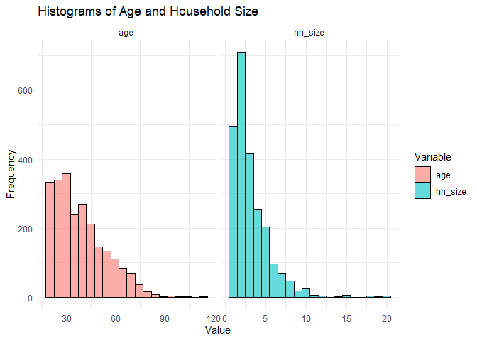

Codebook
================

``` r
# Loading the data
library(haven)
clean_data <- read_dta("~/GitHub/ppol1802/clean_data.dta")


# Convert labeled variables back to factors
clean_data <- as_factor(clean_data)
```

## Data Description

This dataset is a description of Ghanaians view on the Free Senior High
School Policy implemented by the New PatrioTic Party in 2017. It also
comprises of demographic variables and their partisanship stand.These
are all pulled from the Afrobarometer data round 8.

## Variable description

### Main Dependent Variable: policy_support (Binary) Agree with statement 1 is 1 and Agree with Statement 2 is 0.

Question asked in the survey(Afrobarometer): 

Statement 1:Government should have ensured that all the necessary
structures for free SHS are in place before its implementation.

Statement 2: Statement 2: Government took the right decision to start
the implementation of the free SHS policy and address the challenges as
they arise.

## Main independent variables:

Independent Variable 1 (Political Affiliation - Binary). Question: Do
you feel close to any particular political party?

Yes is 1 and No otherwise.

Independent Variable 2 (Politically Affiliation and Political Party)

1 is Yes (NPP) and 0 is No (NDC)

## Control Variables

Age (Continuous) Household Size (continuous) Sex (Binary) Religion
(Binary) Education (Categorical) Employment (Categorical)

``` r
#Summary Statistics
library(dplyr)
```

    ## Warning: package 'dplyr' was built under R version 4.3.3

    ## 
    ## Attaching package: 'dplyr'

    ## The following objects are masked from 'package:stats':
    ## 
    ##     filter, lag

    ## The following objects are masked from 'package:base':
    ## 
    ##     intersect, setdiff, setequal, union

``` r
clean_data%>% 
  select(policy_support, age, hh_size, sex, religion, education, employment) %>% 
  summary()
```

    ##                               policy_support      age          hh_size     
    ##  0. delayed implementation           :1171   30     : 105   Min.   : 1.00  
    ##  1. supports immediate implementation:1107   25     :  93   1st Qu.: 2.00  
    ##  NA's                                :  80   32     :  85   Median : 2.00  
    ##                                              45     :  81   Mean   : 3.15  
    ##                                              40     :  80   3rd Qu.: 4.00  
    ##                                              20     :  72   Max.   :20.00  
    ##                                              (Other):1842                  
    ##         sex                religion              education   
    ##  0. Male  :1184   0. Christians:1780   1. no education: 389  
    ##  1. Female:1174   1. Muslims   : 412   2. Primary     : 555  
    ##                   NA's         : 166   3. Secondary   :1081  
    ##                                        4. Tertiary    : 332  
    ##                                        NA's           :   1  
    ##                                                              
    ##                                                              
    ##          employment  
    ##  1. Unemployed: 443  
    ##  2. Part time : 261  
    ##  3. Full time :1039  
    ##  8            :   1  
    ##  NA's         : 614  
    ##                      
    ## 

``` r
library(ggplot2)
```

    ## Warning: package 'ggplot2' was built under R version 4.3.3

``` r
library(dplyr)
library(tidyr)


clean_data <- clean_data %>%
  mutate(age = as.numeric(as.character(age)))  # Convert factor to numeric

# Convert data to long format for ggplot
clean_data_long <- clean_data %>%
  select(age, hh_size) %>%
  pivot_longer(cols = everything(), names_to = "Variable", values_to = "Value")

# Plot histograms
ggplot(clean_data_long, aes(x = Value, fill = Variable)) +
  geom_histogram(position = "dodge", bins = 20, alpha = 0.6, color = "black") +
  facet_wrap(~Variable, scales = "free_x") +
  labs(title = "Histograms of Age and Household Size", x = "Value", y = "Frequency") +
  theme_minimal()
```

<!-- -->
