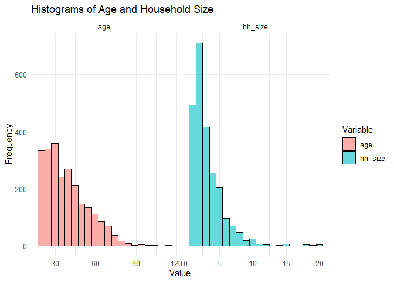
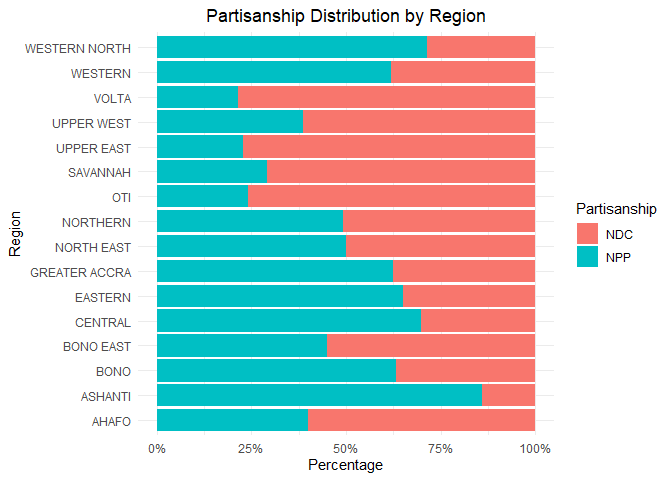
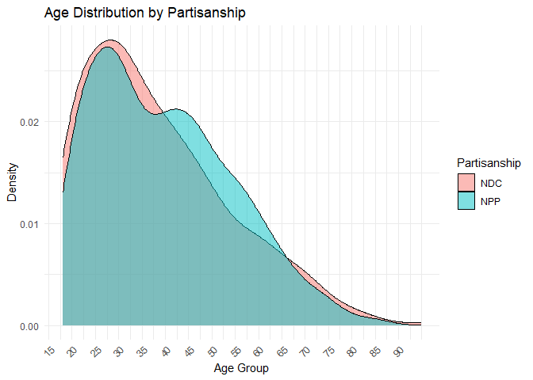
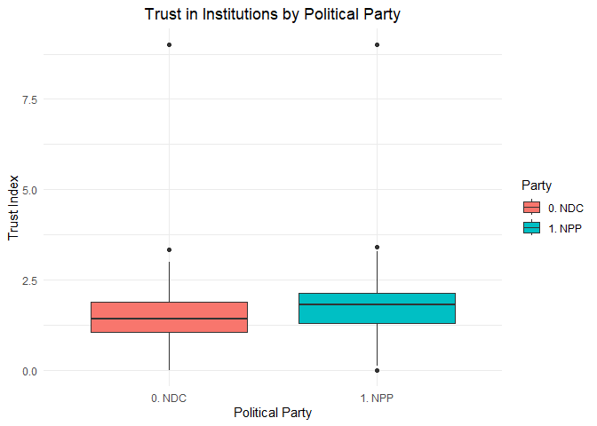
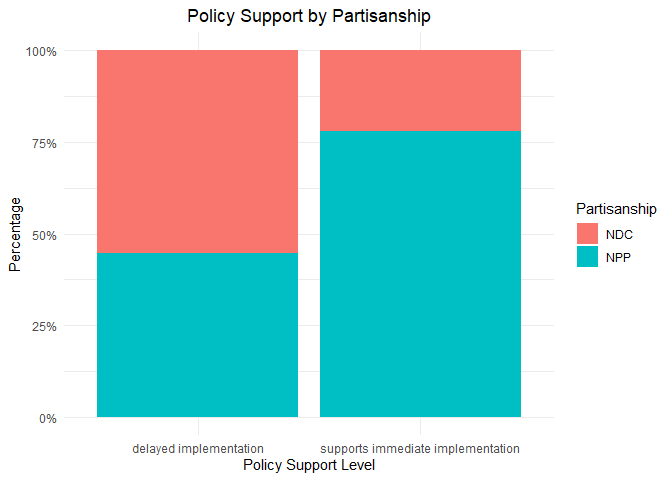

Codebook
================

``` r
# Loading the data
library(haven)
```

    ## Warning: package 'haven' was built under R version 4.3.3

``` r
clean_data <- read_dta("~/GitHub/ppol1802/clean_data.dta")


# Convert labeled variables back to factors
clean_data <- as_factor(clean_data)
```

## Data Description

This dataset is a description of Ghanaians view on the Free Senior High
School Policy implemented by the New PatrioTic Party in 2017. It also
comprises of demographic variables and their partisanship stand.I
extracted them from from the Afrobarometer data round 8.

## Variable description

### Dependent Variables:

## Survey Variables and Questions

### I. Policy Support (Binary)

- **1** = Agree with Statement 1  
- **0** = Agree with Statement 2

**Question asked in the survey:**  
*“Which of the following statements is closest to your view? Choose
Statement 1 or Statement 2.”*

- **Statement 1:** *Government should have ensured that all the
  necessary structures for free SHS are in place before its
  implementation.*  
- **Statement 2:** *Government took the right decision to start the
  implementation of the free SHS policy and address the challenges as
  they arise.*

------------------------------------------------------------------------

### II. Opportunity (Categorical)

- **1** = Strongly Disagree  
- **2** = Disagree  
- **3** = Neither Agree nor Disagree  
- **4** = Agree  
- **5** = Strongly Agree

**Question asked in the survey:**  
*“SHS policy has created opportunity for the poor to obtain education.”*

------------------------------------------------------------------------

### III. Support (Categorical)

- **1** = Strongly Disagree  
- **2** = Disagree  
- **3** = Neither Agree nor Disagree  
- **4** = Agree  
- **5** = Strongly Agree

**Question asked in the survey:**  
*“It is better to have free SHS even if it leads to an increase in the
number of educated citizens who cannot find a job.”*

------------------------------------------------------------------------

### IV. Target (Categorical)

- **1** = Strongly Disagree  
- **2** = Disagree  
- **3** = Neither Agree nor Disagree  
- **4** = Agree  
- **5** = Strongly Agree

**Question asked in the survey:**  
*“In implementing the free SHS policy, the government should have
targeted only the poor who otherwise would not be able to pay for
secondary education.”*

V)Index

## Main Independent Variable

### 1. Political Affiliation and Political Party

- **1** = Yes (Affiliated with NPP)  
- **0** = No (Affiliated with NDC)

**Question asked in the survey:**  
*“Which political party do you feel close to?”*

## Control Variables

Age (Continuous) Household Size (continuous) Sex (Binary) Religion
(Binary) Education (Categorical) Employment (Categorical)

``` r
#Summary Statistics
library(dplyr)
```

    ## Warning: package 'dplyr' was built under R version 4.3.3

    ## 
    ## Attaching package: 'dplyr'

    ## The following objects are masked from 'package:stats':
    ## 
    ##     filter, lag

    ## The following objects are masked from 'package:base':
    ## 
    ##     intersect, setdiff, setequal, union

``` r
clean_data%>% 
  select(opportunity, support, target, policy_support, support_index, age, hh_size, sex, religion, education, employment, urban, present_cond, asset, trust_index, corruption) %>% 
  summary()
```

    ##                         opportunity                            support   
    ##  5. Strongly agree            :1515   5. Strongly agree            :617  
    ##  4. Agree                     : 555   4. Agree                     :578  
    ##  1. Strongly disagree         : 117   1. Strongly disagree         :509  
    ##  2. Disagree                  : 107   2. Disagree                  :464  
    ##  3. Neither agree nor disagree:  64   3. Neither agree nor disagree:177  
    ##  -1. Missing                  :   0   (Other)                      :  0  
    ##  (Other)                      :   0   NA's                         : 13  
    ##                            target                              policy_support
    ##  5. Strongly agree            :695   delayed implementation           :1171  
    ##  1. Strongly disagree         :657   supports immediate implementation:1107  
    ##  4. Agree                     :442   NA's                             :  80  
    ##  2. Disagree                  :438                                           
    ##  3. Neither agree nor disagree:113                                           
    ##  (Other)                      :  0                                           
    ##  NA's                         : 13                                           
    ##  support_index         age          hh_size          sex      
    ##  Min.   :0.6667   30     : 105   Min.   : 1.00   Male  :1184  
    ##  1st Qu.:2.2500   25     :  93   1st Qu.: 2.00   Female:1174  
    ##  Median :2.7500   32     :  85   Median : 2.00                
    ##  Mean   :2.7698   45     :  81   Mean   : 3.15                
    ##  3rd Qu.:3.2500   40     :  80   3rd Qu.: 4.00                
    ##  Max.   :5.0000   20     :  72   Max.   :20.00                
    ##                   (Other):1842                                
    ##        religion           education         employment     urban     
    ##  Christians:1780   no education: 389   Unemployed: 443   Rural:1117  
    ##  Muslims   : 412   Primary     : 555   Part time : 261   Urban:1241  
    ##  NA's      : 166   Secondary   :1081   Full time :1039               
    ##                    Tertiary    : 332   NA's      : 615               
    ##                    NA's        :   1                                 
    ##                                                                      
    ##                                                                      
    ##                   present_cond     asset         trust_index   
    ##  1. Very Bad            :761   Min.   :0.0000   Min.   :0.000  
    ##  4. Fairly Good         :705   1st Qu.:0.8333   1st Qu.:1.059  
    ##  2. Fairly Bad          :588   Median :1.1667   Median :1.529  
    ##  5. Very good           :174   Mean   :1.1639   Mean   :1.599  
    ##  3. Neither good nor bad:123   3rd Qu.:1.5000   3rd Qu.:2.000  
    ##  (Other)                :  0   Max.   :2.8333   Max.   :9.000  
    ##  NA's                   :  7                                   
    ##                  corruption 
    ##  1. Increased a lot   :886  
    ##  3. Stayed the same   :473  
    ##  4. Decreased somewhat:377  
    ##  2. Increased somewhat:353  
    ##  5. Decreased a lot   : 89  
    ##  (Other)              :  0  
    ##  NA's                 :180

``` r
# Convert to data frame explicitly (if needed)
data <- as.data.frame(clean_data)
```

``` r
library(ggplot2)
```

    ## Warning: package 'ggplot2' was built under R version 4.3.3

``` r
library(dplyr)
library(tidyr)
```

    ## Warning: package 'tidyr' was built under R version 4.3.3

``` r
clean_data <- clean_data %>%
  mutate(age = as.numeric(as.character(age)))  # Convert factor to numeric

# Convert data to long format for ggplot
clean_data_long <- clean_data %>%
  select(age, hh_size) %>%
  pivot_longer(cols = everything(), names_to = "Variable", values_to = "Value")

# Plot histograms
ggplot(clean_data_long, aes(x = Value, fill = Variable)) +
  geom_histogram(position = "dodge", bins = 20, alpha = 0.6, color = "black") +
  facet_wrap(~Variable, scales = "free_x") +
  labs(title = "Histograms of Age and Household Size", x = "Value", y = "Frequency") +
  theme_minimal()
```

<!-- -->

``` r
library(ggplot2)
library(dplyr)
library(stringr)
```

    ## Warning: package 'stringr' was built under R version 4.3.3

``` r
# Remove numbers and drop NAs from REGION names
clean_data <- clean_data %>%
  mutate(REGION = str_remove(REGION, "^[0-9]+\\.\\s*")) %>%  # Removes leading numbers & dots
  filter(!is.na(partisanship))  # Drops NAs from REGION

# Now, plot again with clean labels
ggplot(clean_data, aes(y = REGION, fill = as.factor(partisanship))) +
  geom_bar(position = "fill") +
  scale_x_continuous(labels = scales::percent) +
  labs(title = "Partisanship Distribution by Region",
       y = "Region", x = "Percentage",
       fill = "Partisanship") +
  theme_minimal() +
  theme(plot.title = element_text(hjust = 0.5))  # Center the title
```

<!-- -->

``` r
library(ggplot2)
library(dplyr)

# Convert 'age' to numeric (if it's stored as character or factor)
data_clean <- clean_data %>%
  mutate(age = as.numeric(as.character(age)))  # Ensures it's numeric

# Bin Age into Groups (5-year intervals)
data_clean <- clean_data %>%
  mutate(age_group = cut(age, 
                         breaks = seq(15, 90, by = 5),  # 5-year bins
                         labels = paste(seq(15, 85, by = 5), "-", seq(19, 89, by = 5)),
                         right = FALSE))

# Ensure Partisanship is a Factor
data_clean$partisanship <- as.factor(data_clean$partisanship)

# Create Density Plot
ggplot(data_clean, aes(x = age, fill = partisanship)) +
  geom_density(alpha = 0.5) +
  scale_x_continuous(breaks = seq(15, 90, by = 5)) +  # Reduce axis clutter
  labs(title = "Age Distribution by Partisanship",
       x = "Age Group", y = "Density",
       fill = "Partisanship") +
  theme_minimal() +
  theme(axis.text.x = element_text(angle = 45, hjust = 1))  # Rotate labels
```

<!-- -->

``` r
library(ggplot2)
library(dplyr)

# Remove NAs from the Political Party variable
data_clean <- data_clean %>%
  filter(!is.na(pol_party))  # Drop missing values

# Create Boxplot Without NAs
ggplot(data_clean, aes(x = as.factor(pol_party), y = trust_index, fill = as.factor(pol_party))) +
  geom_boxplot() +
  labs(title = "Trust in Institutions by Political Party",
       x = "Political Party", y = "Trust Index",
       fill = "Party") +
  theme_minimal() +
  theme(plot.title = element_text(hjust = 0.5))  # Center the title only
```

<!-- -->

``` r
library(ggplot2)
library(dplyr)

# Remove NAs from Policy Support variable
data_clean <- data_clean %>%
  filter(!is.na(policy_support))  # Drop missing values

# Create Stacked Bar Chart Without NAs
ggplot(data_clean, aes(x = as.factor(policy_support), fill = as.factor(partisanship))) +
  geom_bar(position = "fill") +
  scale_y_continuous(labels = scales::percent) +
  labs(title = "Policy Support by Partisanship",
       x = "Policy Support Level", y = "Percentage",
       fill = "Partisanship") +
  theme_minimal() +
  theme(plot.title = element_text(hjust = 0.5))  # Center the title only
```

<!-- -->
