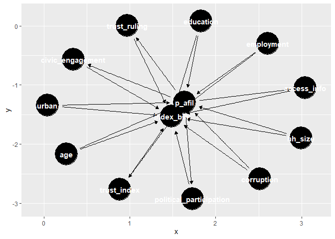
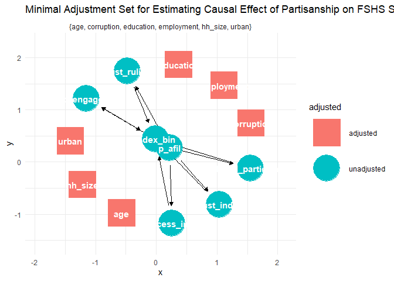

Causal Model for FSHS Support
================
Kingsford Onyina

``` r
# Loading the data
library(haven)
```

    ## Warning: package 'haven' was built under R version 4.3.3

``` r
clean_data <- read_dta("~/GitHub/ppol1802/clean_data.dta")


# Convert labeled variables back to factors
clean_data <- as_factor(clean_data)
```

# **1. Theoretical Model**

This model examines the relationship between partisanship (`p_afil`) and
support for Ghana’s Free Senior High School (FSHS) (`index_bin`). It
includes confounders, mediators, and potential colliders.

``` r
dag <- dagitty('dag {
  p_afil -> index_bin
  p_afil -> access_info -> index_bin
  p_afil -> civic_engagement -> index_bin
  p_afil -> trust_index -> index_bin
  p_afil -> political_participation -> index_bin
  p_afil -> trust_ruling -> index_bin

  hh_size -> index_bin
  hh_size -> p_afil
  age -> index_bin
  age -> p_afil
  urban -> index_bin
  urban -> p_afil
  employment -> index_bin
  employment -> p_afil
  corruption -> index_bin
  corruption -> p_afil

  education -> p_afil
  education -> index_bin
}')
```

``` r
ggdag(dag)
```

<!-- -->

## **1. Confounders**

- **hh_size** (Household Size)
- **age**  
- **urban** (Urban or Rural location)  
- **employment** (Employment status)  
- **corruption** (Perception of Corruption)

## **2. Mediators**

- **access_info** (Access to information which is an index from a
  battery of questions from radio, TV, newspaper, internet, media)  
- **civic_engagement**(An index from a battery of questions that depicts
  civic engagement: protesting, attending community meeting, contacting
  traditional leader, contacting local government, raising issues)  
- **trust_index** (Trust in institutions is an index created from a
  battery of questions on trust in presidency, court system, parliament,
  electoral commision etc. )  
- **political_participation** (An index from a battery of questions that
  depicts political participation: voting, disucssion of politics,
  attending rallies, contacting political party officials)
- **trust_ruling** (Trust in ruling party)  
- **education** (No primary education, primary, secondary and tertiary)

## **Collider**

- Didn’t find any collider unfortunately.

# **3. Identify Minimal Adjustment Set**

``` r
adjustmentSets(dag, exposure = "p_afil", outcome = "index_bin")
```

    ## { age, corruption, education, employment, hh_size, urban }

``` r
# Highlighting the minimal adjustment set in the DAG
ggdag_adjustment_set(dag, exposure = "p_afil", outcome = "index_bin") +
  theme_minimal() +
  labs(title = "Minimal Adjustment Set for Estimating Causal Effect of Partisanship on FSHS Support")
```

<!-- -->

# **Description of the Minimal Adjustment Set**

The **minimal adjustment set** consists of the **confounding variables**
that we need to **control for** to estimate the causal effect of
`p_afil` (partisanship) on `index_bin` (support for FSHS) **without
bias**.

- **`age`**: Older or younger individuals may have different
  perspectives on FSHS.
- **`corruption`**: Perception of corruption could influence both trust
  in government and policy support.
- **`education`**: Higher education levels might impact both political
  alignment and views on FSHS.
- **`employment`**: Employment status affects economic perspectives,
  which may shape policy support.
- **`hh_size`**: Household size may influence economic strain and
  support for education policies.
- **`urban`**: Urban vs. rural residence can shape access to information
  and political views.

Since **these variables confound** the relationship, they need to be
**adjusted for**, or controlled for.
