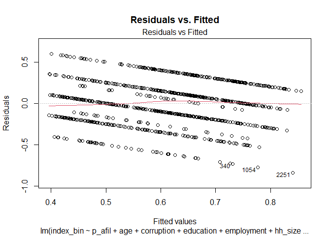
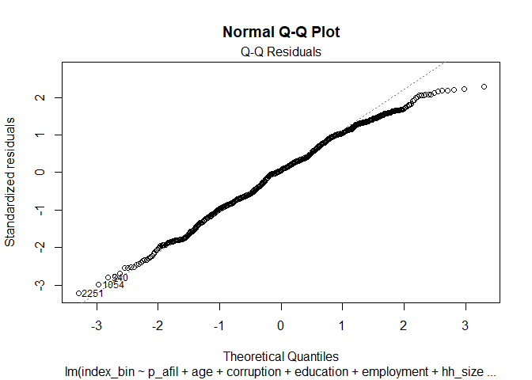
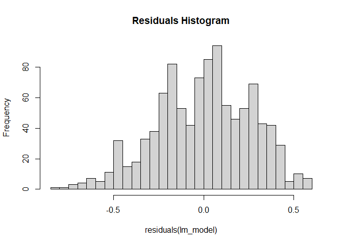

Multiple Linear Regression
================
Kingsford Onyina

``` r
# Loading the data
library(haven)
```

    ## Warning: package 'haven' was built under R version 4.3.3

``` r
clean_data <- read_dta("~/GitHub/ppol1802/clean_data.dta")


# Convert labeled variables back to factors
clean_data <- as_factor(clean_data)
```

Based on my minimal adjustment set, I estimate a simple multiple linear
regression below.

``` r
library(dplyr)
```

    ## Warning: package 'dplyr' was built under R version 4.3.3

    ## 
    ## Attaching package: 'dplyr'

    ## The following objects are masked from 'package:stats':
    ## 
    ##     filter, lag

    ## The following objects are masked from 'package:base':
    ## 
    ##     intersect, setdiff, setequal, union

``` r
# Convert age and hh_size to numeric
clean_data <- clean_data %>%
  mutate(age = as.numeric(as.character(age)),
         hh_size = as.numeric(as.character(hh_size)))

# Run the adjusted model
lm_model <- lm(index_bin ~ p_afil + age + corruption + education + employment + hh_size + urban, data = clean_data)
summary(lm_model)
```

    ## 
    ## Call:
    ## lm(formula = index_bin ~ p_afil + age + corruption + education + 
    ##     employment + hh_size + urban, data = clean_data)
    ## 
    ## Residuals:
    ##      Min       1Q   Median       3Q      Max 
    ## -0.84072 -0.18227  0.01674  0.20205  0.59966 
    ## 
    ## Coefficients:
    ##                                   Estimate Std. Error t value Pr(>|t|)    
    ## (Intercept)                      3.736e-01  3.853e-02   9.697  < 2e-16 ***
    ## p_afil1. NPP                     1.417e-01  1.828e-02   7.751 2.22e-14 ***
    ## age                              1.111e-03  5.733e-04   1.938  0.05294 .  
    ## corruption2. Increased somewhat  7.911e-02  2.521e-02   3.139  0.00175 ** 
    ## corruption3. Stayed the same     5.700e-02  2.346e-02   2.430  0.01528 *  
    ## corruption4. Decreased somewhat  1.476e-01  2.373e-02   6.221 7.22e-10 ***
    ## corruption5. Decreased a lot     1.723e-01  3.776e-02   4.562 5.70e-06 ***
    ## education2. Primary              7.735e-02  2.769e-02   2.794  0.00531 ** 
    ## education3. Secondary            2.807e-02  2.570e-02   1.092  0.27496    
    ## education4. Tertiary             2.723e-02  3.352e-02   0.812  0.41692    
    ## employment1. Employed           -1.411e-02  1.711e-02  -0.825  0.40962    
    ## hh_size                          1.762e-05  3.553e-03   0.005  0.99604    
    ## urban1. Urban                    3.218e-02  1.731e-02   1.859  0.06334 .  
    ## ---
    ## Signif. codes:  0 '***' 0.001 '**' 0.01 '*' 0.05 '.' 0.1 ' ' 1
    ## 
    ## Residual standard error: 0.2636 on 1006 degrees of freedom
    ##   (1381 observations deleted due to missingness)
    ## Multiple R-squared:  0.1552, Adjusted R-squared:  0.1451 
    ## F-statistic:  15.4 on 12 and 1006 DF,  p-value: < 2.2e-16

The results show that partisanship is strongly associated with FSHS
support, with NPP affiliates 14.2 percentage points more likely to
support the policy. Perceptions of corruption remain significant, as
those who believe corruption decreased somewhat (7.9 percentage points)
or significantly (17.2 percentage points) show higher support. Age, now
treated as continuous, shows a small but significant positive
association (0.1 percentage points per year), suggesting older
individuals are slightly more supportive. Education and urban residence
are marginally significant, with those having primary education (7.3
percentage points) showing higher support, while urban dwellers exhibit
a weak positive association (3.2 percentage points). Household size and
employment status are not significant predictors. The model, now
correctly aligned with the minimal adjustment set, explains 15.5% of the
variation in FSHS support, confirming that other unobserved factors
influence public opinion.

# \*\*Does the Model Deviate from the Minimal Adjustment Set?

My model aligns with the minimal adjustment set, but some confounders
seem unnecessary. Household size and employment status do not
significantly influence the relationship between partisanship and FSHS
support, reducing efficiency without adding value. Urban residency shows
only marginal significance, suggesting a weak impact. Age remains
significant, showing a small positive association, while corruption
perception plays a crucial role, reinforcing its importance. Although
the model supports my adjustment strategy, removing non-significant
confounders could enhance precision without compromising validity.

# \*\*Multicollinearity Check (VIF Test)

``` r
library(car)
```

    ## Warning: package 'car' was built under R version 4.3.3

    ## Loading required package: carData

    ## Warning: package 'carData' was built under R version 4.3.3

    ## 
    ## Attaching package: 'car'

    ## The following object is masked from 'package:dplyr':
    ## 
    ##     recode

``` r
vif(lm_model)
```

    ##                GVIF Df GVIF^(1/(2*Df))
    ## p_afil     1.159374  1        1.076742
    ## age        1.054655  1        1.026964
    ## corruption 1.148515  4        1.017459
    ## education  1.198548  3        1.030645
    ## employment 1.058261  1        1.028718
    ## hh_size    1.074293  1        1.036481
    ## urban      1.098370  1        1.048031

This insniates absence of of multicollinearity since all the VIFs are \<
10

# \*\*Based on the reading, I opted for the residual plots.

``` r
# Residuals vs. Fitted Plot (Linearity & Homoscedasticity)
plot(lm_model, which = 1, main = "Residuals vs. Fitted")
```

<!-- -->

``` r
# Normal Q-Q Plot (Normality of Residuals)
plot(lm_model, which = 2, main = "Normal Q-Q Plot")
```

<!-- -->

# \*\*\*Interpretation

The Residuals vs. Fitted plot shows a structured pattern rather than
random scatter, suggesting potential heteroskedasticity or non-linearity
in the model. The residuals are not randomly distributed around zero,
indicating that some variance is not well captured by the model.

The Normal Q-Q plot shows deviations from normality at both extremes,
particularly in the lower and upper tails. This suggests that the
residuals are not perfectly normally distributed, which could impact
inference and standard errors.

# \*\*Heteroskedasticity Test (Breusch-Pagan Test)

``` r
library(lmtest)
```

    ## Warning: package 'lmtest' was built under R version 4.3.3

    ## Loading required package: zoo

    ## Warning: package 'zoo' was built under R version 4.3.3

    ## 
    ## Attaching package: 'zoo'

    ## The following objects are masked from 'package:base':
    ## 
    ##     as.Date, as.Date.numeric

``` r
bptest(lm_model)
```

    ## 
    ##  studentized Breusch-Pagan test
    ## 
    ## data:  lm_model
    ## BP = 11.759, df = 12, p-value = 0.4652

With the p-value being insignificant insinuates that the standard errors
are robust.

# \*\*Normality of Residuals

``` r
shapiro.test(residuals(lm_model))  # Shapiro-Wilk test
```

    ## 
    ##  Shapiro-Wilk normality test
    ## 
    ## data:  residuals(lm_model)
    ## W = 0.99081, p-value = 5.51e-06

``` r
hist(residuals(lm_model), breaks = 30, main = "Residuals Histogram")  # Histogram
```

<!-- -->
